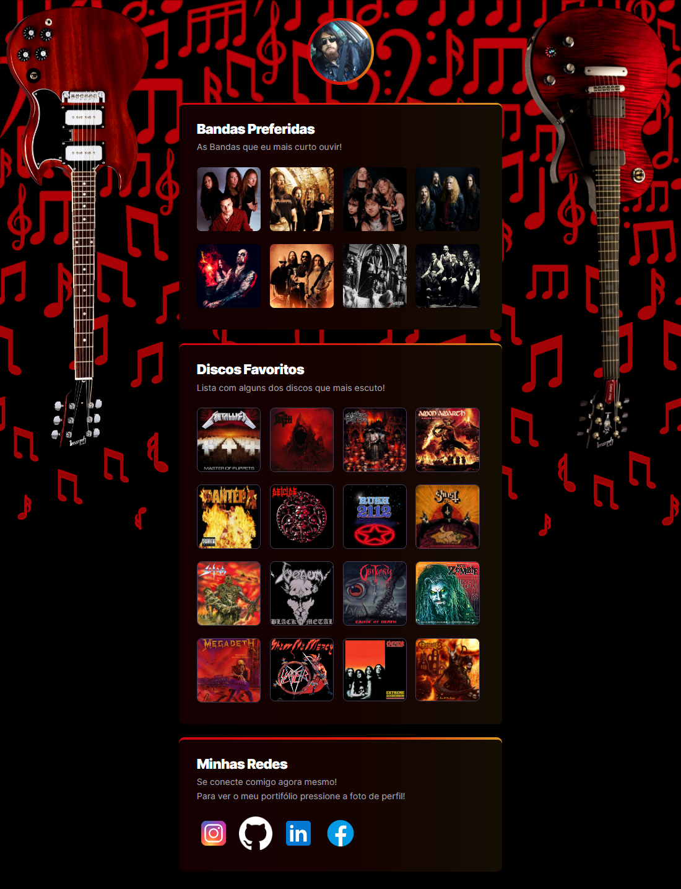

# Projeto feito a partir do NLW_Rocketseat_Explorer

## [Link do Projeto Original do Evento](https://github.com/Filipe-Bacof/NLW_Rocketseat_Explorer_Esports)

## [Link do Deploy do Projeto Original](https://filipe-bacof.github.io/NLW_Rocketseat_Explorer_Esports/)

## [Acesse Meu Portifólio](https://portifolio-filipe-bacof.vercel.app/)

## [Ver Deploy deste projeto](https://filipe-bacof.github.io/Musicas-Bacof/)

### Minhas Músicas Preferidas com link para o Spotify e minhas redes sociais

## Variação do Projeto versão 2:

## Variação do Projeto versão 1:

- Não sou o melhor designer do mundo, mas essa UI ficou bem boa, e bem melhorável, foz o background nas pressas com o Gimp
